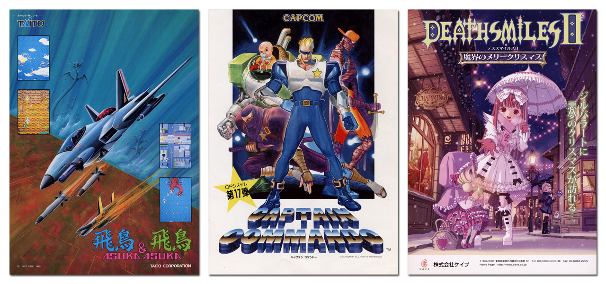

# VG Art

This public repository contains a dump of some posters and box scans I use in my
emulator launcher. When possible, I'll mention the source of the scanned images.

The images will be divided by "platform" (at the moment only MAME is shared),
and country/region 3-letter ISO code.

I don't know what's the maximum size of public (free) repositories in github;
there is a chance this repository will eventually go beyond the limit, and hence
I'll delete it.

    

